# No Accounts Plox

Remove annoying login walls, sign-up popups, banners, and “open in app” prompts so you can browse peacefully without creating an account.

Designed for use with [uBlock Origin](https://github.com/gorhill/uBlock?tab=readme-ov-file#ublock-origin-ubo).


---

## Table of Contents

- [Features](#features)
- [Supported websites](#supported-websites)
- [Filter list](#filter-list)
- [Installation](#installation)
  - [Option 1 - Raw GitHub URL](#option-1---raw-github-url)
  - [Option 2 - CDN mirrors](#option-2---cdn-mirrors)
- [How to add the list in uBlock Origin](#how-to-add-the-list-in-ublock-origin)
- [Compatibility](#compatibility)
- [Example Images](#example-images)
  - [Youtube](#youtube)
  - [Tiktok](#tiktok)
  - [Reddit](#reddit)
  - [ChatGPT](#chatgpt)
  - [Gemini](#gemini)
  - [Pinterest](#pinterest)
- [Contributing](#contributing)
- [License](#license)

## Features

* Removes login/signup popups
* Hides “continue in app” banners
* Cleans intrusive overlays
* Lightweight filter list
* Easy to install

---

## Supported websites

* [https://www.youtube.com](https://www.youtube.com)
* [https://www.tiktok.com](https://www.tiktok.com)
* [https://www.reddit.com](https://www.reddit.com) - [https://old.reddit.com](https://old.reddit.com)
* [https://chatgpt.com](https://chatgpt.com)
* [https://gemini.google.com](https://gemini.google.com)
* [https://www.pinterest.com](https://www.pinterest.com)

More sites may be added over time.

---

## Filter list

Preview the rules here:

* [`noaccountsplox.txt`](./noaccountsplox.txt)

---

## Installation

### Option 1 - Raw GitHub URL

Add this URL manually in your ad blocker:

```txt
https://raw.githubusercontent.com/Alplox/No-Accounts-Plox/main/noaccountsplox.txt
```

---

### Option 2 - CDN mirrors

#### jsDelivr

```txt
https://cdn.jsdelivr.net/gh/Alplox/No-Accounts-Plox@main/noaccountsplox.txt
```

#### GitHack

```txt
https://rawcdn.githack.com/Alplox/No-Accounts-Plox/main/noaccountsplox.txt
```

#### Statically

```txt
https://cdn.statically.io/gh/Alplox/No-Accounts-Plox/main/noaccountsplox.txt
```

---

## How to add the list in uBlock Origin

1. Open uBlock Origin settings
2. Go to **Filter lists**
3. Scroll to **Custom**
4. Paste one of the URLs above
5. Click **Apply changes**

---

## Compatibility

Tested with:

* uBlock Origin

> [!NOTE]
> Other content blockers may work, but are not officially tested.

---

## Example Images

### Youtube

<table>
  <tr>
    <td align="center">
      <strong>Before</strong><br>
      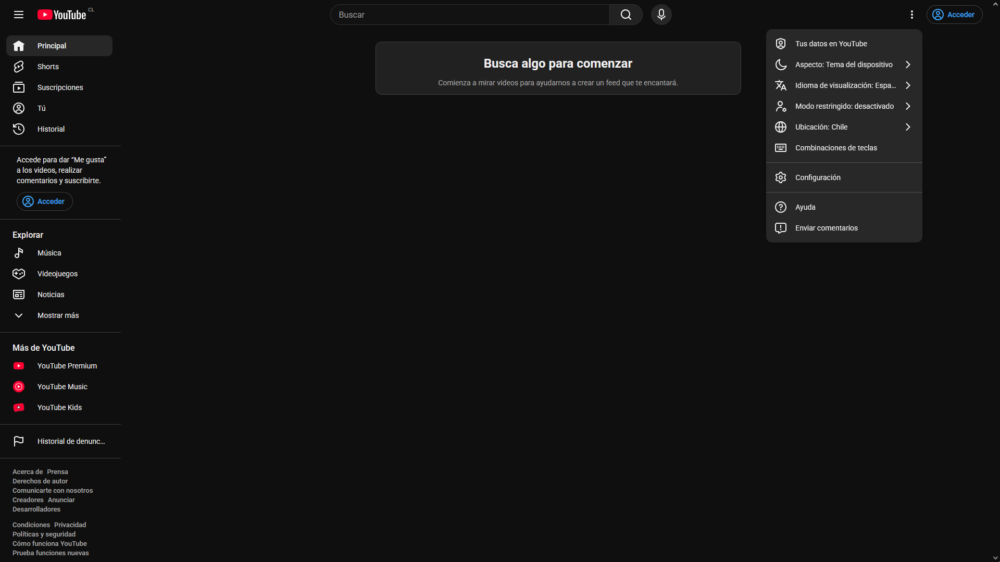
    </td>
    <td align="center">
      <strong>After</strong><br>
      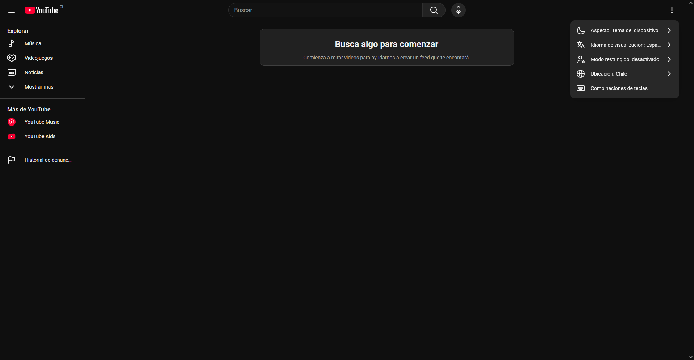
    </td>
  </tr>
</table>

### Tiktok

<table>
  <tr>
    <td align="center">
      <strong>Before</strong><br>
      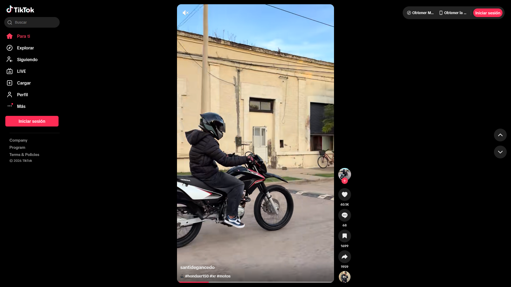
    </td>
    <td align="center">
      <strong>After</strong><br>
      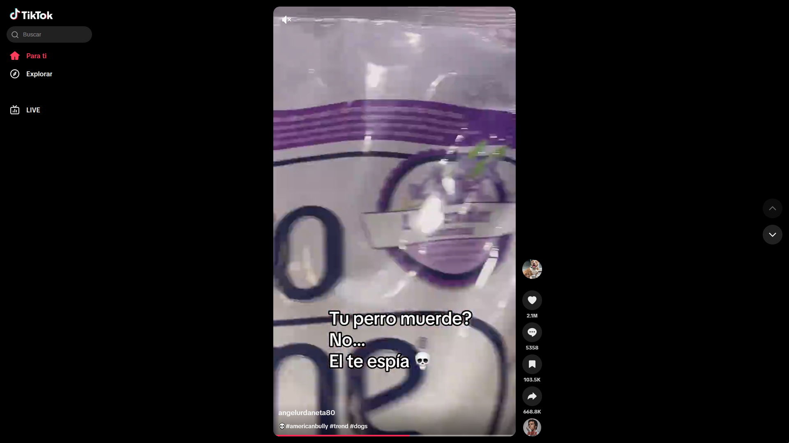
    </td>
  </tr>
</table>

### Reddit

<table>
  <tr>
    <td align="center">
      <strong>Before</strong><br>
      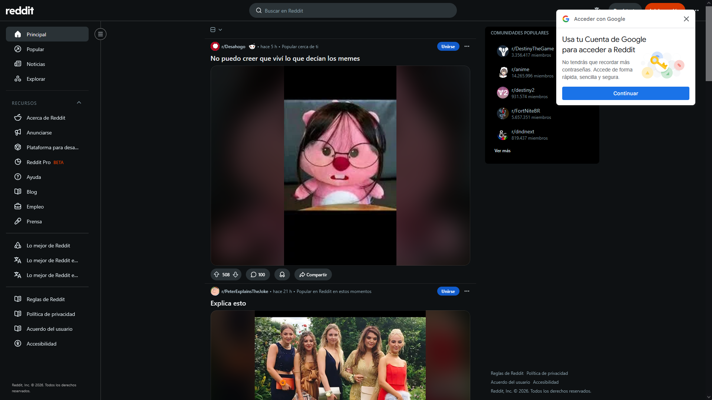
    </td>
    <td align="center">
      <strong>After</strong><br>
      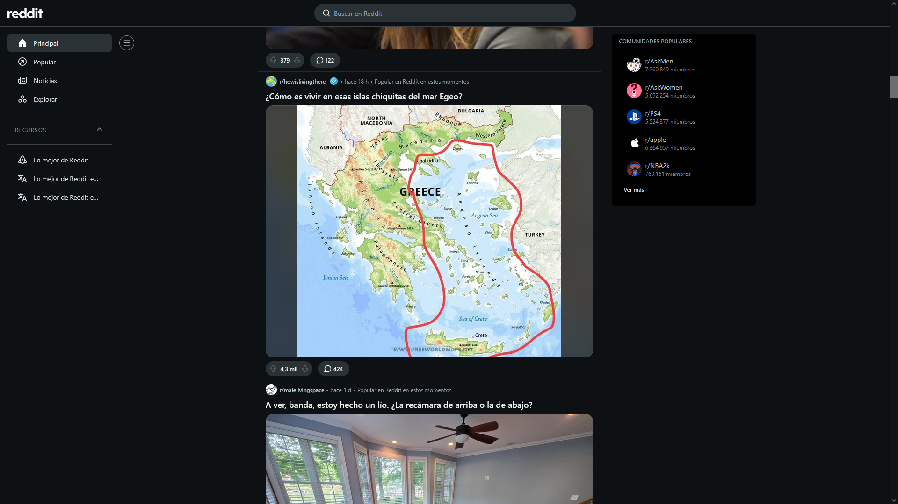
    </td>
  </tr>
</table>

### ChatGPT

<table>
  <tr>
    <td align="center">
      <strong>Before</strong><br>
      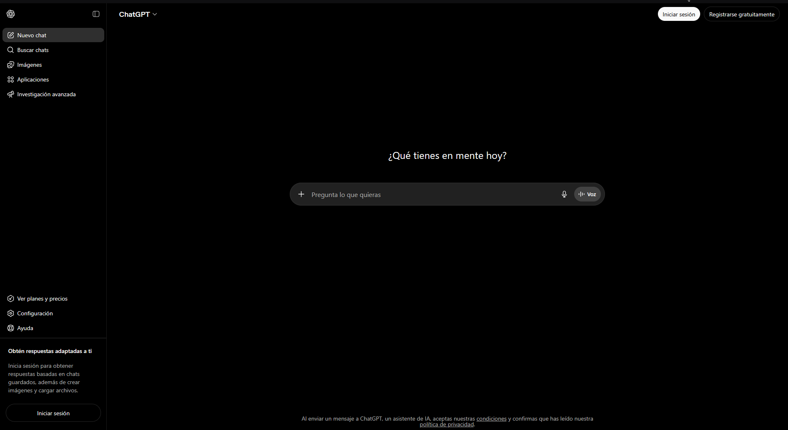
    </td>
    <td align="center">
      <strong>After</strong><br>
      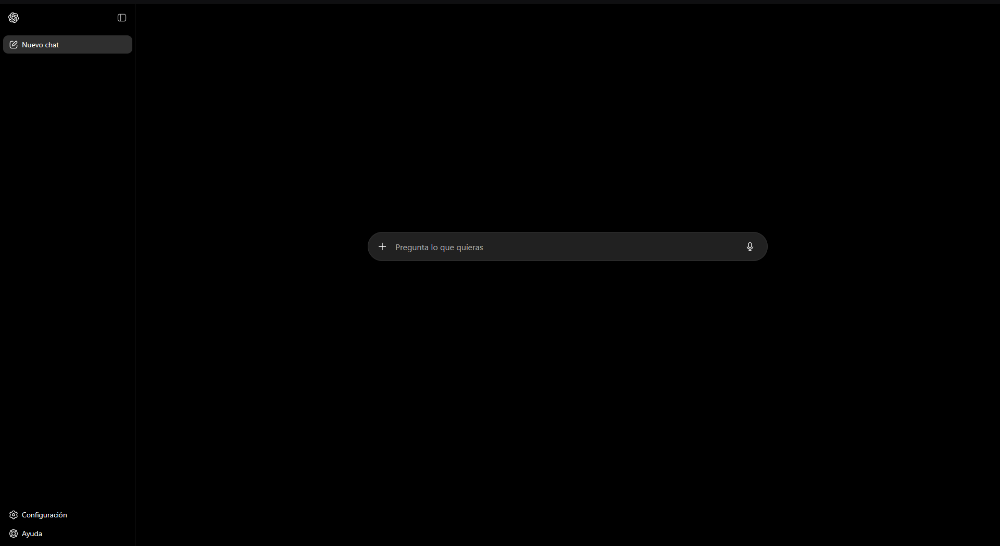
    </td>
  </tr>
</table>

### Gemini

<table>
  <tr>
    <td align="center">
      <strong>Before</strong><br>
      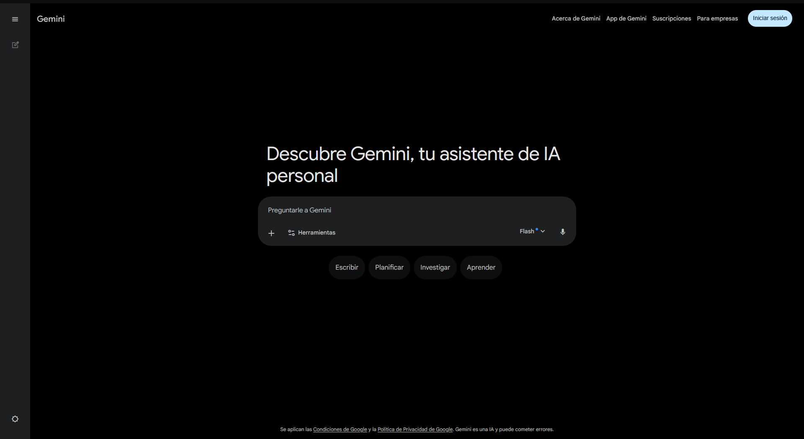
    </td>
    <td align="center">
      <strong>After</strong><br>
      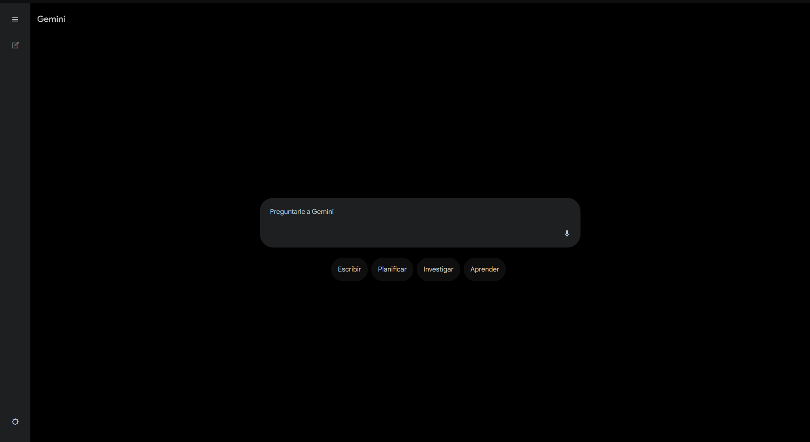
    </td>
  </tr>
</table>

### Pinterest

<table>
  <tr>
    <td align="center">
      <strong>Before</strong><br>
      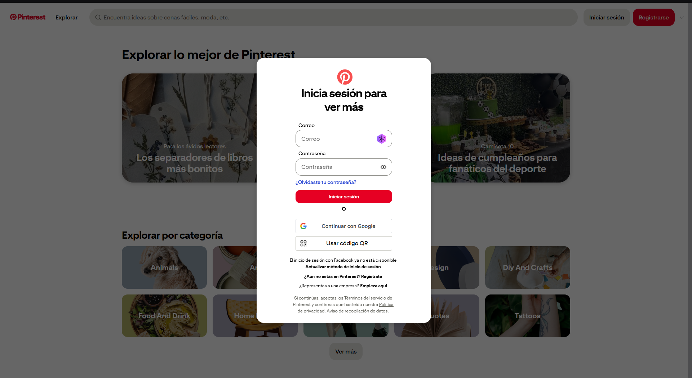
    </td>
    <td align="center">
      <strong>After</strong><br>
      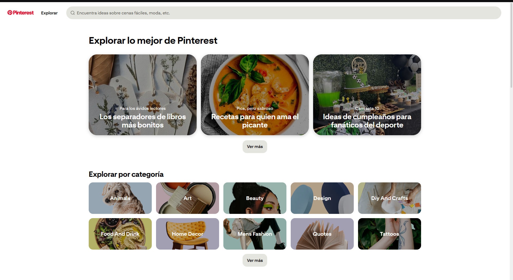
    </td>
  </tr>
</table>

---

## Contributing

Pull requests, reports, and suggestions are welcome.

If a website starts forcing login o registration again, open an issue.

---

## License

Licensed under the MIT License.

* [`LICENSE`](./LICENSE)
